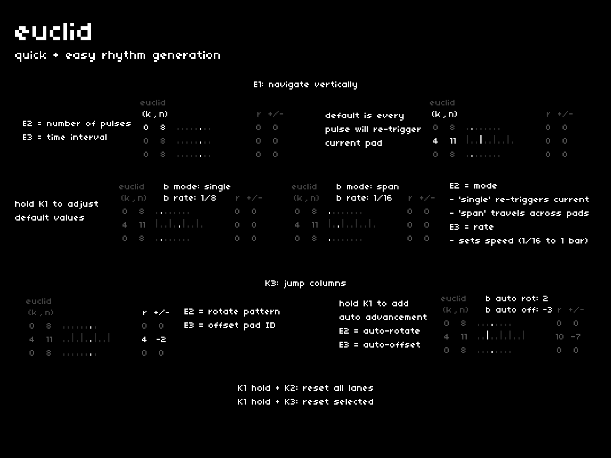

while rambling patterns are nice to explore, sometimes you just want a steady stream of triggers.  
**[euclid]** offers traditional euclidean sequencing with unique modes to help quickly sequence sound.

## navigation + control
---

| hardware |--->| action |
|:---|:---:|:---|
| `E1` |--->| switch focus between the three bank lanes |
| `E2 + E3` |--->| adjust selected parameter (either k,n or r,+/-) |
| `K3` |--->| switch between (k,n) or r and +/- |
| `K1 hold` |--->| access meta parameters |
| `K1 hold + K2` |--->| reset all lanes to first position |
| `K1 hold + K3` |--->| reset selected lane to first position |

## (k,n)
---

euclidean sequences are calculated using two values:

- k: number of pulses
- n: time interval

as k changes, the pulses will be distributed across n's total as evenly as possible.

### K1: mode and rate

holding `K1` when **(k,n)** is selected allows you to change the default mode and rate of each euclidean sequencer.

**modes**

- **single** (default): each pulse will re-trigger the currently selected pad
- **span**: each pulse will trigger the pad that corresponds to the pulse's position on screen

**rate**

- you can specify the rate of each sequencer, from 1/16th notes to whole notes.

## r and +/-
---

rotation and offset are two additional parameters which can add variety to your euclidean sequences.

- **r**: rotate the pattern pulses
- **+/-**: offset the pad played on the corresponding pulse

adjusting these two parameters have definite impact regardless of mode, as they adjust the rhythm and sound that's played, but they're particularly effective with **span** mode.

### K1: auto

holding `K1` when **r** and **+/-** is selected allows you to automate shifts applied to these parameters. the automation is applied at the end of the rhythm chain.