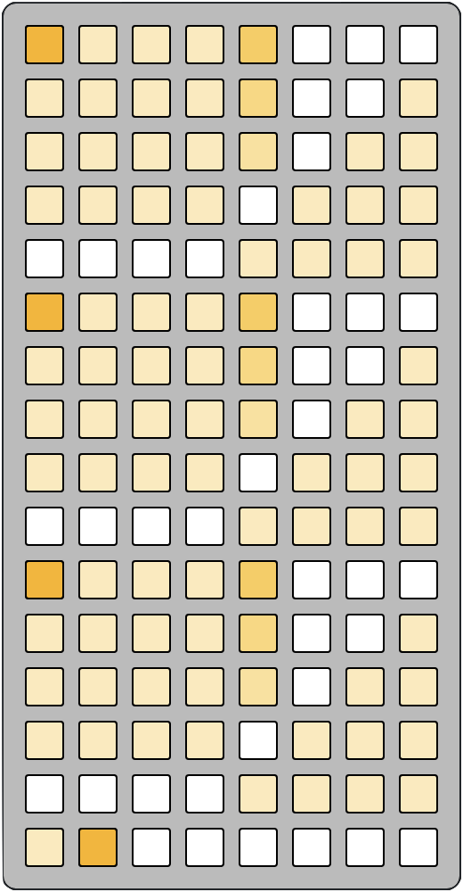
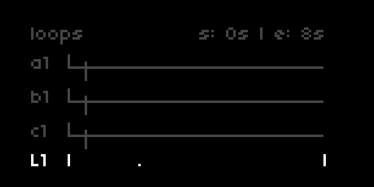
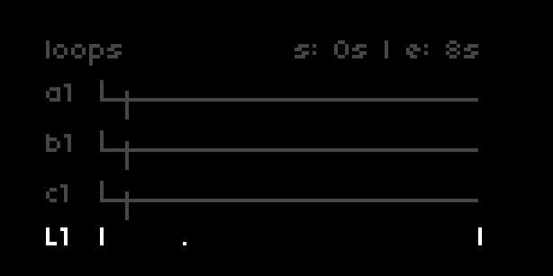
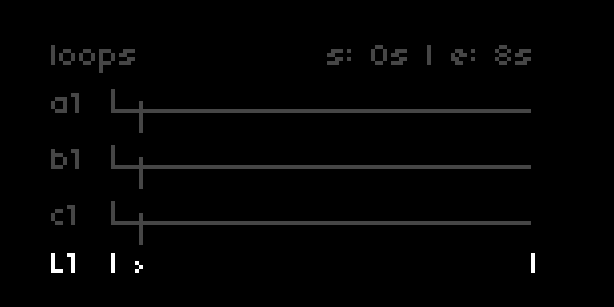
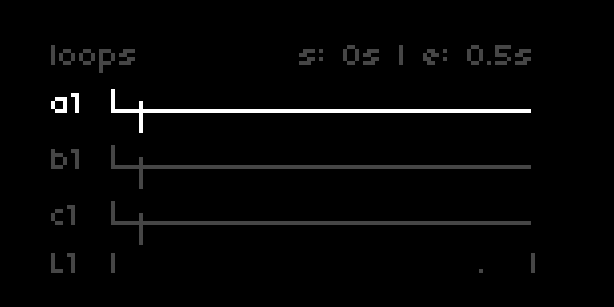
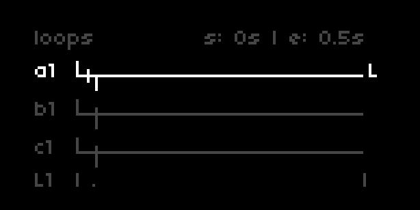

cheat codes has a highly adaptable grid interface with three unique pages.  
so as to not dump a *ton* of info on you, each of the docs sections will have a relevant grid subsection.

as a reference, here are legends for each grid page:

- [navigation](#navigation)
- [the Live buffers](#live)
- [the Clip buffers](#clips)
- [banks + pads](#banks_and_pads)

# navigation

<!-- ## `E1` -->

there are four loop lanes on the `[loops]` page; one for each bank and one for the Live buffers.  

`E1` changes focus between them:

*nb. the `s:`tart and `e:`nd times in the top right corner reflect the loop points for the selected lane*

<h2 id = "live">Live buffers</h2>

cheat codes has three Live buffers to record into, which can be adjusted many ways.

<h3 id = "live-buffer-controls">controlling the Live buffer</h3>

navigate down to the Live loop lane and press `K3` to cycle between:

- loop points (default view)
- total length + feedback amount
- mode (looping or 1-shot) + random record probability

*nb. the % counter on the second page indicates playhead position in relation to loop length*

### recording into the Live buffer

with the Live loop lane selected, hold `K1` and press `K3` to toggle recording to the Live buffer on/off.

- if in *loop* mode, recording will engage wherever the playhead is located between the loop points
- if in *once* mode, recording will begin at the loop start point

### Live buffer loop points

the default view of the Live loop lane is its loop points.

see `PARAMETERS > loops + buffers > rec loop enc resolution` to choose the resolution of an encoder turn.  
0.1s and 0.01s are absolute time scales, while (1/16, 1/8, 1/4, 1/2, 1 bar) are derived from the current bpm.  
*nb. when switching resolutions, the Live buffer loop window will snap to one unit of the specified resolution.*
- `E2`: move start point (based on `rec loop enc resolution`)
- `E3`: move end points (based on `rec loop enc resolution`)
- `K1 hold` + `E1`: jump loop points together (uniformly distributed, if possible)

if `rec loop enc resolution` is at its default 0.1s, these additional actions are available:
- `K1 hold` + `E2`: move start point (fine,0.01s)
- `K1 hold` + `E3`: move end point (fine,0.01s)

### random recording probability

with the Live loop lane selected, press `K3` until you see `mode` and `rnd prob`.  
here, you can adjust the likelihood that recording state will be toggled by a random counter.  

- if in *loop* mode, a recording state coin will be tossed every 4 beats
- if in *once* mode and `rec loop enc resolution` is 0.1s or 0.01s, a recording state coin will be tossed every 1/16th note
- if in *once* mode and `rec loop enc resolution` is a clock-synced value, a recording state coin will be tossed once every loop

### switch Live buffer + change Live buffer length

cheat codes has three Live buffers, which can record up to 32 seconds each.

with the Live loop lane selected, press `K3` until you see `total`.

- `E2`: change the total length of each Live buffer to 8, 16 or 32 seconds
- `K1 hold` + `E1`: switch between the three Live buffers (L1, L2, L3)

<h2 id = "clips">Clips</h2>

in addition to live sampling, cheat codes also has three Clip buffers for pre-recorded audio.  
to load a Clip, navigate to `PARAMS > loops + buffers > clips`.  
the Clip buffers dynamically resize to fit samples as short as a few hundred milliseconds to 32 seconds.  
*nb. files must be 48khz .wav files to retain original pitch and they are imported as mono.*

<h2 id = "banks_and_pads">banks + pads</h2>

tap `K3` on any bank's loop lane to switch between these sets of control for the current pad:

- loop points
- rate + slew
- buffer reference + semitone offset

### loop a pad

to get a pad looping without a grid or MIDI keyboard, hold `K1` and press `K3`.  
the `L` on the right of the lane refelcts that the current pad is looping.

*nb. when you hold K1, you will see an asterisk next to the selected lane*

### loop points

when a bank's controls are set to loop points:

- `E2`: move start point (coarse, 0.1s)
- `E3`: move end points (coarse, 0.1s)
- `K1 hold` + `E1`: move start and end together (coarse, 0.1s)
- `K1 hold` + `E2`: move start point (fine,0.01s)
- `K1 hold` + `E3`: move end point (fine,0.01s)

*nb. you can also map this to a MIDI controller under `PARAMS > manual control params > start point [x]` and `... end point [x]`*

### rate + slew

*rate* adjusts the speed and direction of pad playback.  
*slew* defines how many seconds it will take to get to the specified rate (if previous rate is different).

- `E2`: change rate for the current pad
- `E3`: change slew for the current pad
- `K1 hold` + `E2`: change rate for *all* pads to the value of the current pad
- `K1 hold` + `E3`: change slew for *all* pads to the value of the current pad

*nb. you can also map this to a MIDI controller under `PARAMS > manual control params > rate [x]` and `... rate slew time [x]`*

NEED GIF

### buffer reference + semitone offset

*Live: x* / *Clip: x* defines which buffer the pad is using.  
*offset* adds a semitone offset to the pad's rate.  

- `E2`: change buffer for the current pad
- `E3`: change semitone offset for the current pad
- `K1 hold` + `E2`: change buffer for *all* pads to the value of the current pad
- `K1 hold` + `E3`: change semitone offset for *all* pads to the value of the current pad

NEED GIF

*nb. when changing between each buffer, pad loops are resized according to the total length of the buffer*

### change pad

with any of the bank lanes selected (and controlling any parameter except for loops):

- `K1 hold` + `E1`: change selected bank's current pad

*nb. you can also map this to a MIDI controller under `PARAMS > manual control params > current pad [x]`*

### sync clock to loop

while exploring loop points, you may find a nice section that you'd want to base your whole session around.  

- `K1 hold` + `K2`: sync global clock (patterns, delays, arps, euclid, etc) to the current loop's length