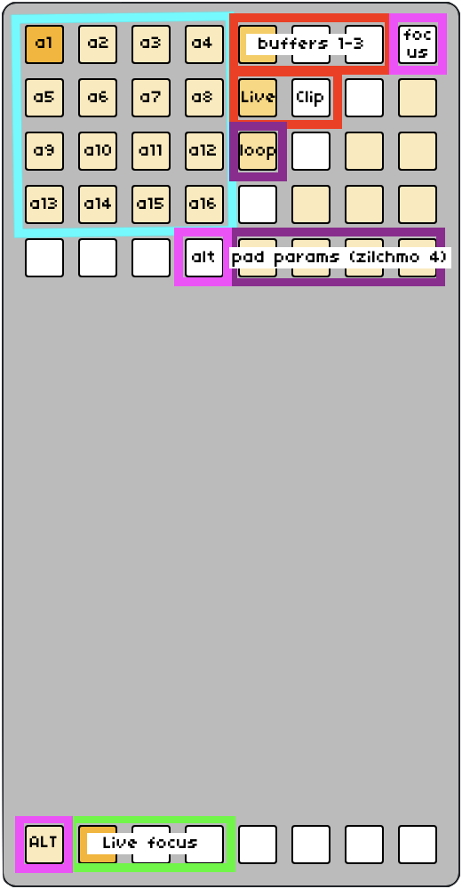

maybe just do a video???

- BLUE
  - [the bank's 16 pads](../docs-loops/#banks_and_pads)
  - press any pad to instantly recall the settings for that pad
  - monophonic -- one pad recalled at a time
- RED
  - Live + Clip: switch between [Live](../docs-loops/#live) and [Clip](../docs-loops/#clips) mode
  - buffers 1-3: switch between each of the three buffers for the specified mode
- PURPLE:
  - loop: enable looping for the current pad
  - pad params / zilchmo 4: 