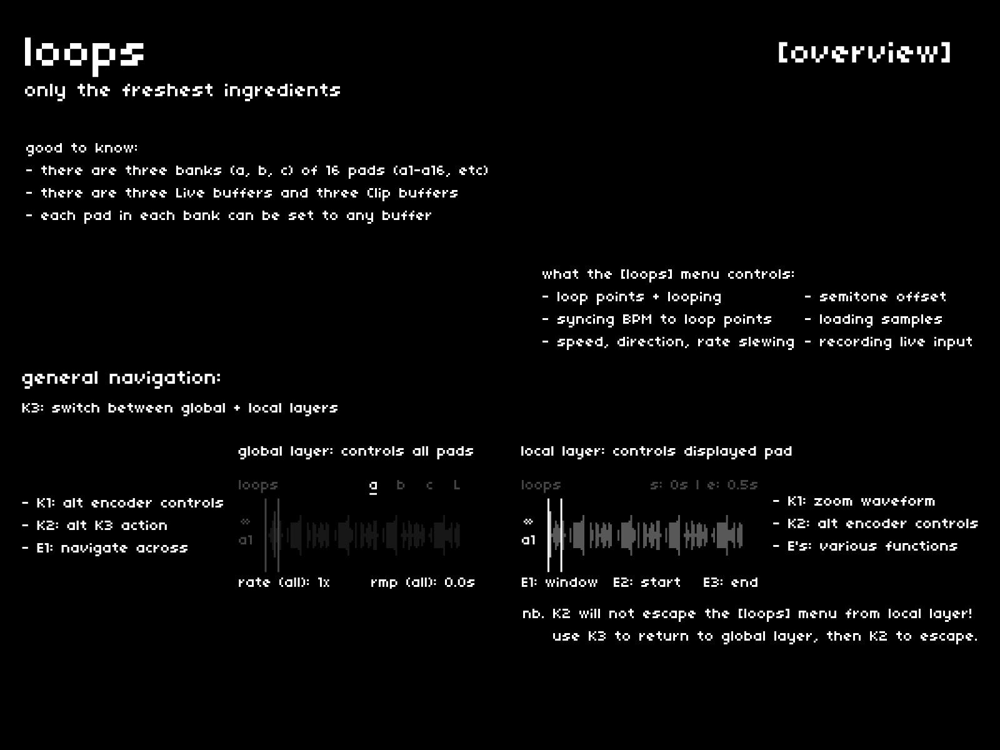

cheat codes features three banks (a, b, c) of 16 pads (a1-a16, etc), three Live buffers and three pre-recorded Clip buffers.  
each pad can have its own *totally unique* settings for loop points, speed + direction, buffer, etc.  
the **[loops]** page is where you define these settings.

## navigation + control
---

| hardware |--->| action |
|:---|:---:|:---|
| `E1` |--->| switch between banks and Live buffers |
| `E2, E3` |--->| adjust on-screen parameters |
| `K3` |--->| switch between the global and local layers |
| `K1 hold` |--->| reveal alternate encoder controls |
| `K2 hold` |--->| reveal alternate key controls |

## global and local
---

there are two navigation layers to the [loops] menu: global and local.

for banks:

- *global*: facilitates quick bank-wide adjustments to buffer assignment, rate, slewing, and semitone offsets
- *local*: facilitates pad-specific adjustments to the aforementioned parameters, as well as loop points and BPM syncing

for Live buffers:

- *global*: facilitates quick adjustments to feedback, random recording, loop mode and duration for the displayed Live buffer
- *local*: facilitates detailed changes to loop points, buffer erasure, and changing which Live buffer is currently active
- since neither layer controls all three Live buffers, you can also initiate recording from either

*nb. if you are on the local layer, `K2` cannot be used to escape to the main menu. you will have to press `K3` to move back to the global layer, from which you can exit as expected with `K2`.*