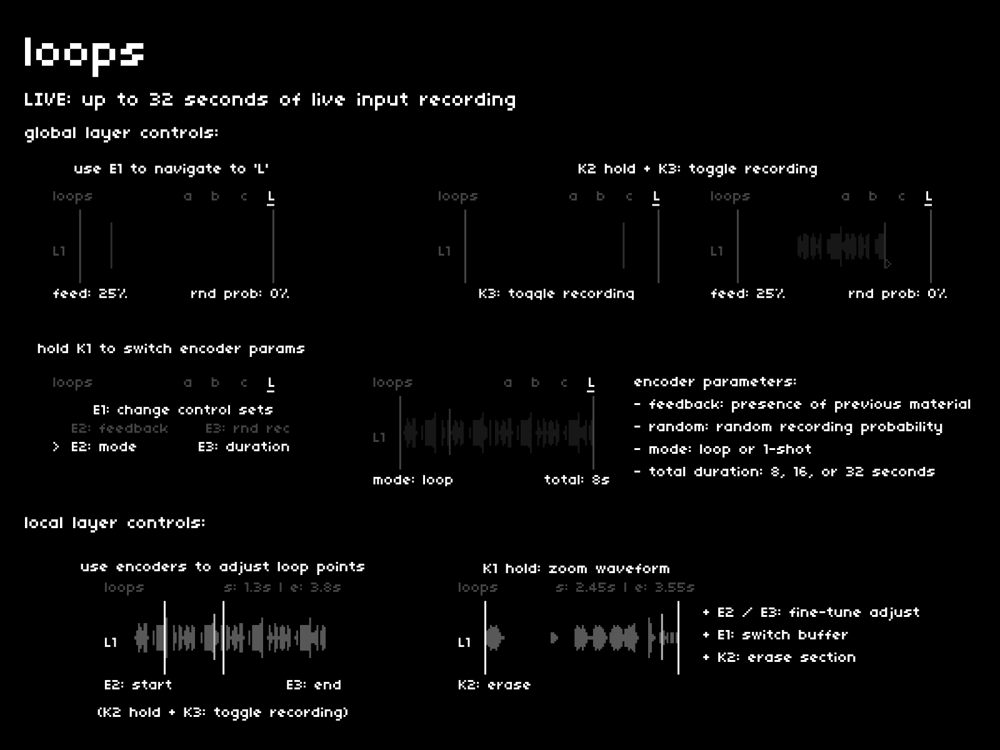

## navigation + control
---

### global

| hardware |--->| action |
|:---|:---:|:---|
| `E1` |--->| switch between banks and Live buffers |
| `E2, E3` |--->| adjust on-screen parameters |
| `K3` |--->| switch between the global and local layers |
| `K1 hold` |--->| reveal alternate encoder parameters |
| `K1 hold + E1` |--->| switch encoder parameters |
| `K2 hold + K3` |--->| toggle recording |

### local

| hardware |--->| action |
|:---|:---:|:---|
| `E1` |--->| move loop window |
| `E2, E3` |--->| adjust loop points |
| `K3` |--->| switch between the global and local layers |
| `K1 hold` |--->| zoom waveform |
| `K1 hold + E1` |--->| switch Live buffer |
| `K1 hold + K2` |--->| erase buffer content between loops |
| `K2 hold + K3` |--->| toggle recording |

## global layer encoder parameters
---

there are four primary encoder parameters on the global layer:

- **feed**: how much previous material is retained with each pass of the record head
- **rnd prob**: the likelihood that recording will be randomly toggled
- **mode**: looping or one-shot behavior
- **total**: manipulates the record speed to allow for 8, 16, or 32 second duration

## loop or one-shot?

depending on your needs, each record mode holds unique possibilities.

### loop mode

strengths:

- un-clocked and flexible for creating soundscapes and weird delays
- set-and-forget
- **rnd prob** adds a lot of creative power, adding out-of-sequence captures of audio along a flat timeline

weaknesses:

- not suitable for clocked recording
- can become a morass with certain settings
- can be hard to specify exact placement of incoming audio without also managing loop points

### one-shot mode

strengths:

- synced to the global clock for tight captures and easy flips
- stops recording when the playhead reaches the end point
- easier to manage exact placement of incoming audio (always starts at the start point)

weaknesses:

- can be a bit rigid for unstructured play
- requires a bit more thought about where to place new audio