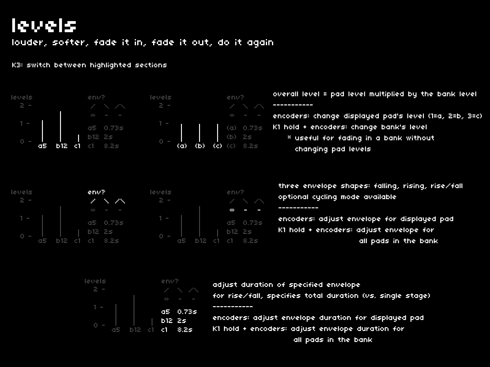

a sound's presence is crafted by its overall level: loud, soft, fading in, fading out, etc.  
as with most parameters in cheat codes, each pad in each bank can have its own level settings.  
the **[levels]** page is where you define these settings.

## navigation + control
---

| hardware |--->| action |
|:---|:---:|:---|
| `K3 press` |--->| switch focus between the four parameters |
| `K1 hold` |--->| selected parameter applies to entire bank |
| `E1, E2, E3` |--->| change selected parameter for pad or bank |

## overall level
---

with the first section selected, each of the three encoders controls a pad's level.  
overall level is determined by the *pad level* multiplied by the *bank level*.  
each encoder adjusts the level of the displayed pad.  

`K1 hold`: toggle between *pad level* and *bank level*  
*nb. this is useful for fading in an entire bank without changing each pad's individual level*

## envelope shapes + cycle
---

the second section introduces an envelope, with three shapes:
- falling
- rising
- rise/fall

the third section defines whether the envelopes cycle or if they execute once per pad press.

`E1, E2, E3`: adjust envelope for current pad in banks a, b, c   
`K1 hold`: adjust envelope for every pad in associated bank

## envelope duration
---

the fourth section specifies the duration of the envelope, from 100ms to 60 seconds (exponential).

`E1, E2, E3`: adjusts envelope duration for current pad in banks a, b, c   
`K1 hold`: adjust envelope duration for every pad in associated bank