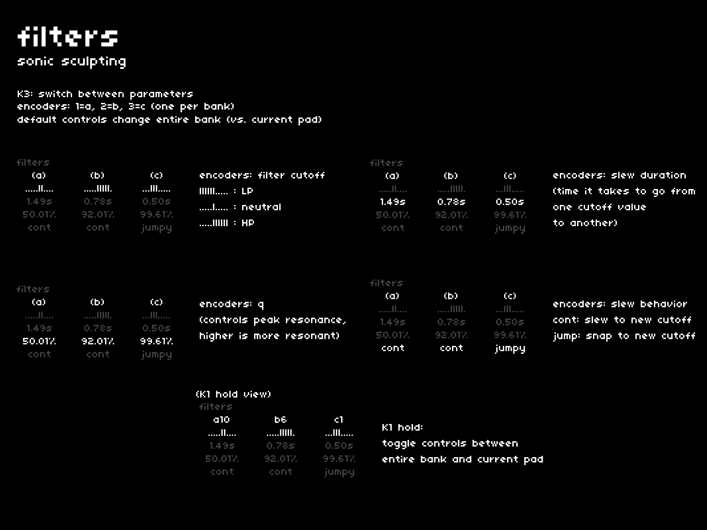

timbre imparts new perspective on known sounds, highlighting overlooked frequencies and textural components.  
while each pad can have its own filter settings, filters are first applied to the entire bank by default.  
the **[filters]** page features three low-pass/hi-pass combos with slewing.

## navigation + control
---

| hardware |--->| action |
|:---|:---:|:---|
| `K3` |--->| switch focus between parameters |
| `E1 + E2 + E3` |--->| adjust selected parameter (E1=a, E2=b, E3=c)|
| `K1 hold` |--->| toggle controls between entire bank and current pad |

## parameters
---

### cutoff
each filter is a lo-pass/hi-pass combo:

- turn the encoders CW for hi-pass filtering
- turn the encoders CCW for lo-pass filtering

### slew
if pads have differing filter cutoff values, you can apply a variable slew to describe the time it should take to move from one value to the next.

### q
the resonance of the filter is described as its **q** value.

- neutral: 50.01%
- nicely present: ~92%
- boarding oscillation: 99+%

### slew behavior
describes what happens when a filter cutoff is in process of slewing toward a value and it receives a new value.  
eg. a filter starts at neutral and is making its way toward full hi-pass, but a new pad is played with a mid lo-pass value.

- **cont**: slew time is applied to the transition from the current value to the new destination
- **jumpy**: slew is canceled and filters immediately jump to the new destination

## bank control or pad control?
---

cheat codes offers opportunities to establish different filter values for each pad.

pad-specific values can be desirable in some cases, like slower-moving pieces where pads are occasionally changed.  
when used in combination with unique slew times, this can lead to unique expressions.

for faster-moving arpeggiations, retaining control over the entire bank creates opportunities for effective spectral-sweeping gestures.