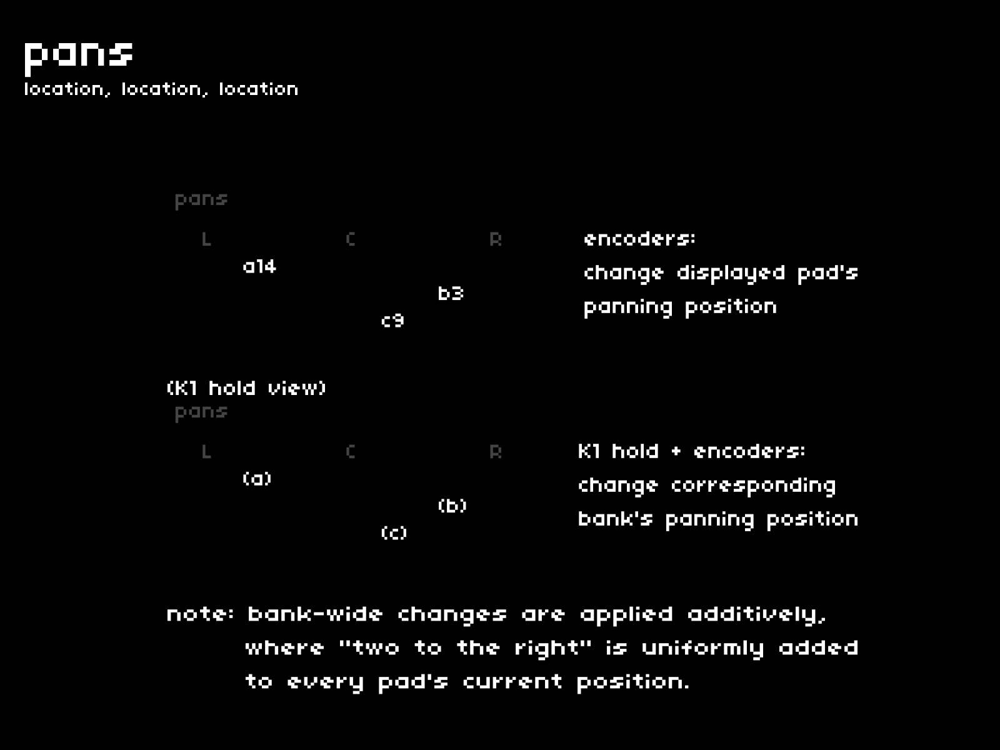

placement of a sound in the stereo field can contribute to its unique identity.  
the **[pans]** page is a straightforward control panel which unlocks pads' geographic potential.

## navigation + control
---

| hardware |--->| action |
|:---|:---:|:---|
| `E1 + E2 + E3` |--->| adjust panning for each pad (E1=a, E2=b, E3=c)|
| `K1 hold + encoders` |--->| adjust panning for entire bank, additively |

---

when adjusting panning for an entire bank, please note that:

- adjustments are uniformly added to every pad's current position
- it's possible to smoosh all pads to either extreme by continuing to turn the encoder