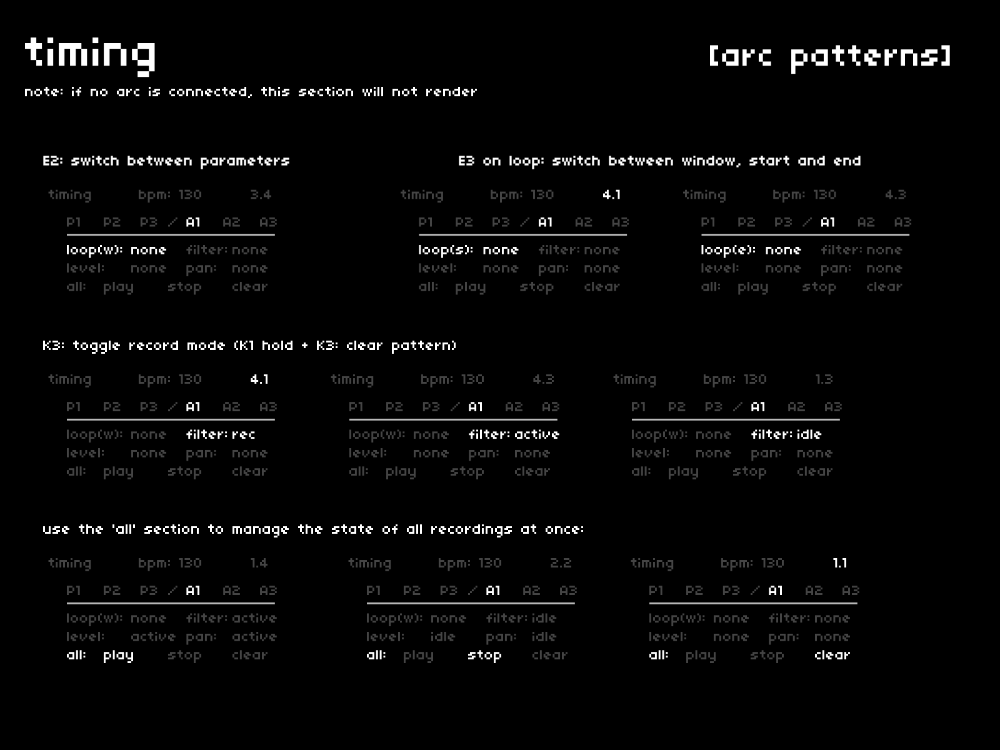

if an [arc](https://monome.org/docs/arc/) is connected, it can be used to control pad loop points, filtering, levels, and panning.  
these adjustments can be recorded and played back via a connected grid, but also through the on-screen UI.

## navigation + control
---

| hardware |--->| action |
|:---|:---:|:---|
| `E2` |--->| scroll through the selected arc pattern's parameters |
| `E3` on *loop* |--->| switch controls between window, start and end |
| `K3` |--->| toggle record/playback/pause for selected parameter |
| `K1 hold + K3` |--->| clear selected parameter's pattern |

the *all* section provides a central set of controls to manage all recorded arc patterns at once.  
use `K3` on any of these meta-controls to execute them.