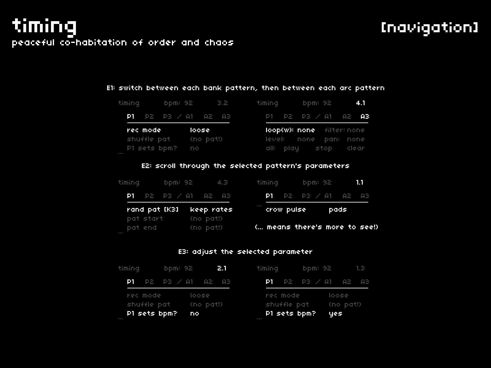

the previous screens have helped craft identities for our pads. now, let's see how well they play together.  
the **[timing]** menu is where pads go to hang out with their friends.

## navigation + control
---

| hardware |--->| action |
|:---|:---:|:---|
| `E1` |--->| switch between patterns |
| `E2` |--->| scroll through the selected pattern's parameters |
| `E3` |--->| adjust the selected parameters |

## ...
---

as you scroll through a pattern's parameters, you'll see an ellipsis on the left.  

- if it's toward the bottom, this means that there's more to see by turning `E2` CW
- if it's toward the top, this means that you've reached the end of the menu, so turn CCW to scroll back up