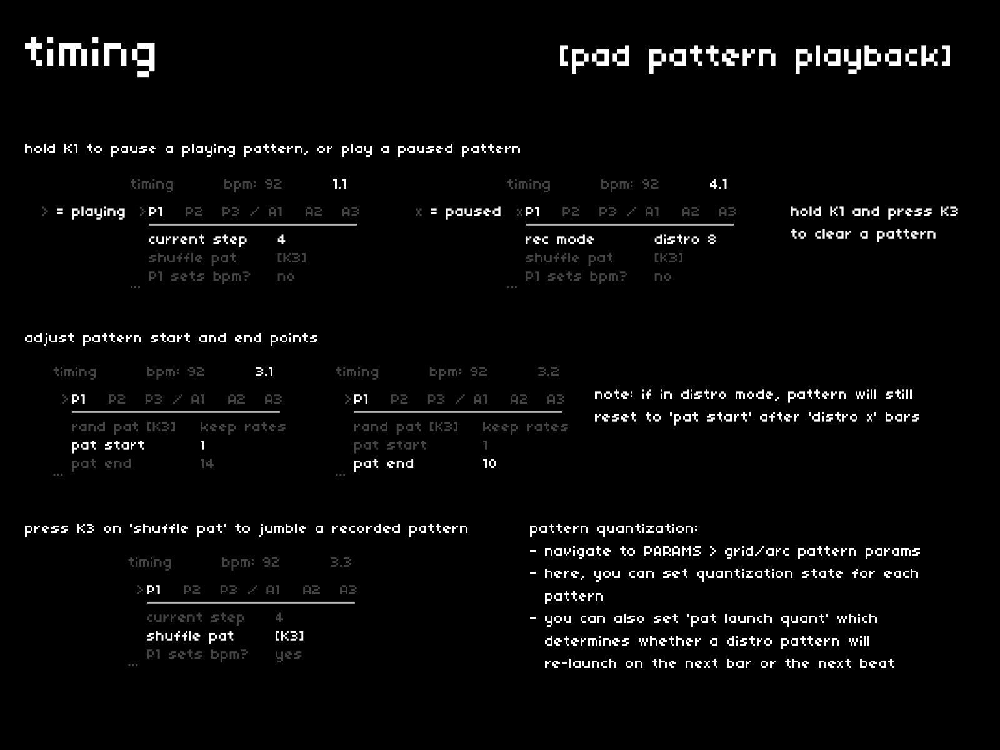

## K1: play, pause, clear

patterns automatically loop until paused or cleared.

- after a pattern is recorded, hold `K1` to toggle a pattern between play and pause
- while holding `K1`, press `K3` to clear a recorded pattern

## pattern launch quantization

since **distro** patterns are always aware of the clock, playback commands are held until the next clock event.  
you can specify whether this clock event should be the next beat (default) or the "1" of the next bar.  
to change the default behavior, navigate to *PARAMS > grid/arc pattern params > pat launch quant*.

## start + end points

after a pattern is generated, you can adjust its start and end points.  
these are event-based, so the default values represent how many pad events are held in a pattern.

if in **distro** mode, a pattern will always restart after the specified number of bars.  
if the pattern's start/end points are adjusted, this defines an "inner reset" for the automatic looping which then receives an "outer reset" every x bars.  
this may lead to interesting, if not unexpected, results.

## shuffle a pattern

to inject a bit of random into your patterns, press `K3` on the *shuffle pat* parameter.  
this will rearrange the events and their timing to create alter egos for your patterns.