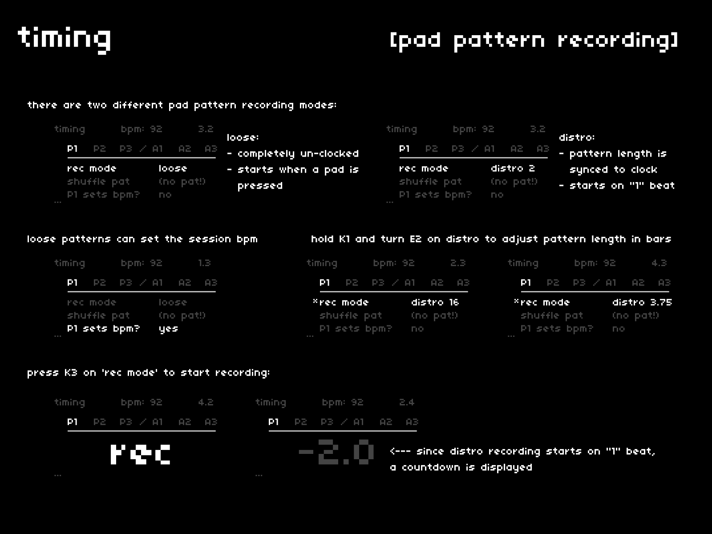

## recording modes
---

two different behaviors define pad pattern recording.

- **loose**: completely un-clocked recording, which starts when a pad is pressed and plays back unaware of global tempo
- **distro**: pattern length is synced to the clock and recording starts on the nearest "1" beat after being activated
  - this mode allows for delayed pad entry, since a placeholder event is registered at the "1" beat

each has its own benefits and work together to create both wandering or locked-step patterns.

## record pattern
---

to start recording, press `K3` on the **rec mode** parameter.  
if in **distro** mode, you'll see a countdown appear to show you how many beats remain until the next "1".

## K1: adjusting **distro** length
---

to adjust the length of a **distro** pattern, hold `K1` and turn `E2`.  
**distro** length is displayed in bars, with lengths of 1 beat (0.25) up to 16 bars.  
each `E2` turn will adjust the length by 1 beat (0.25).

## set bpm from loose pattern
---

as you work with cheat codes, you may discover that it's easier to play in a **loose** pattern with the right *feel* than it is to pre-select a bpm for **distro** mode.

to help honor this, cheat codes can set the global tempo from a **loose** pattern:

- enable *P(x) sets bpm?* for the desired bank (x)
- start recording a **loose** pattern
- after recording, you'll see the bpm in the top-center of the screen adjust