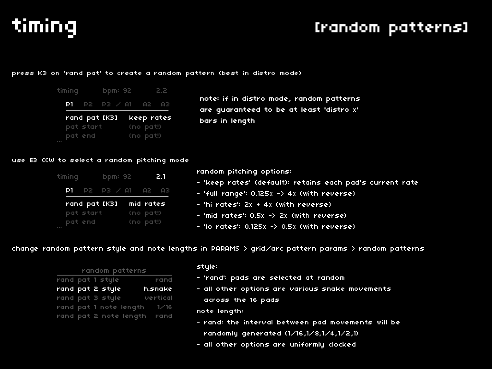

generating a random pattern can be a fantastic way to explore how your pads fit together.  
*note: some parameters can completely rewrite a bank's rate and level values. while fun, this can be frustrating if you have meticulously crafted your pads.*

## controlling random
---

random patterns are generated with these parameters in mind:

- whether the *rec mode* is **loose** or **distro**
- whether the *rand pat* parameter is set to *keep rates* or a destructive value
- the *rand pat style* listed under *PARAMS > grid/arc pattern params > random patterns*
- the *rand pat note length* listed under *PARAMS > grid/arc pattern params > random patterns*

### *rec mode* impact

- **loose**: random patterns can be of variable length, with up to 32 events
- **distro**: random patterns are guaranteed to be at least the distro length, with some overspill to explore start/end points

### *rand pat* rate

generating a random pattern can also rewrite your pads' rates:

- *keep rates* (default): retain's your pads' current rates
- *full range*: 0.125x -> 4x (with reverse)
- *hi rates*: 2x + 4x (with reverse)
- *mid rates*: 0.5x -> 2x (with reverse)
- *lo rates*: 0.125x -> 0.5x (with reverse)

*note: to avoid blasting your ears with 4x loops at full volume, a pad's randomly generated rate will also assign a level value appropriate for the new rate.*

### *PARAMS > grid/arc pattern params > random patterns*

**style**

in addition to total randomized selection, the *rand pat* function can also be used to generate traditional patterns like those found in Make Noise's René sequencer:

- *rand* (default): pads are selected at random
- *horizontal*: 1,2,3,4,5,6,7,8,9,10,11,12,13,14,15,16
- *h.snake*: 1,2,3,4,8,7,6,5,9,10,11,12,16,15,14,13
- *vertical*: 1,5,9,13,2,6,10,14,3,7,11,15,4,8,12,16
- *v.snake*: 1,5,9,13,14,10,6,2,3,7,11,15,16,12,8,4
- *top-in*: 1,2,3,4,8,12,16,15,14,13,9,5,6,7,11,10
- *bottom-in*: 13,14,15,16,12,8,4,3,2,1,5,9,10,11,7,6
- *zig-zag*: 1,2,5,9,6,3,4,7,10,13,14,11,8,12,15,16
- *wrap*: 1,6,11,16,15,10,5,2,7,12,8,3,9,14,13,4

**note length**

the final component of random patterning is the length of each generated step.  
the default state, *rand*, creates a mix of syncopations and held notes. note length may also be clamped to static values (1/16, 1/8, 1/4, 1/2, and 1).