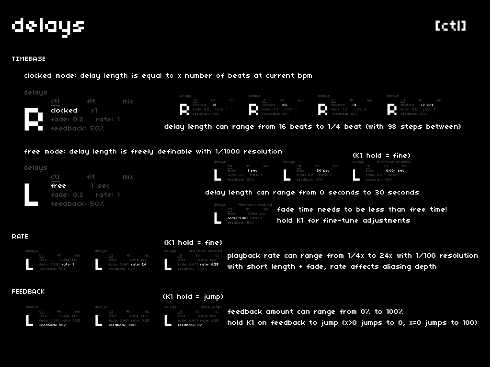

## TIMEBASE

the delay features two modes:

- **clocked**: delay length is equal to x number of beats at the current bpm, ranging from 1/4 beat to 16 beats with 98 steps in between
- **free**: delay length is freely definable, ranging from 0 to 30 seconds
  - hold `K1` while adjusting the **free** length to adjust at 1/1000s resolution
  - for best results, keep *fade time* less than or equal to delay length
