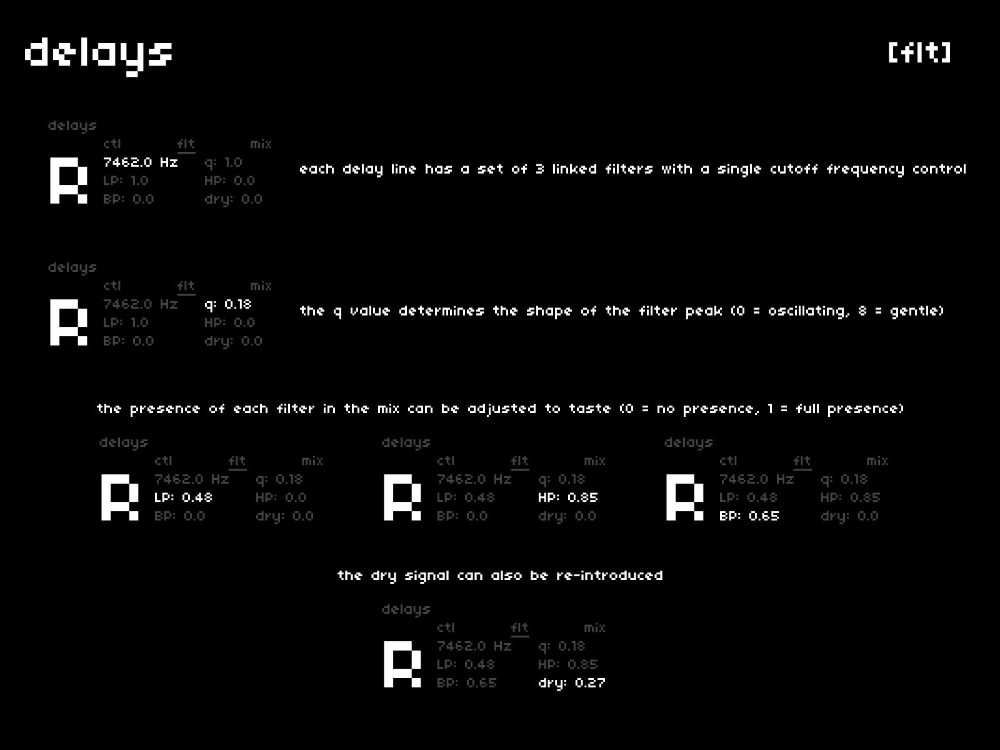

each delay line features three filters, linked by a single cutoff frequency and resonance setting.  
the presence of each filter in the mix can be adjusted to taste. if desired, the dry signal can also be surfaced.

