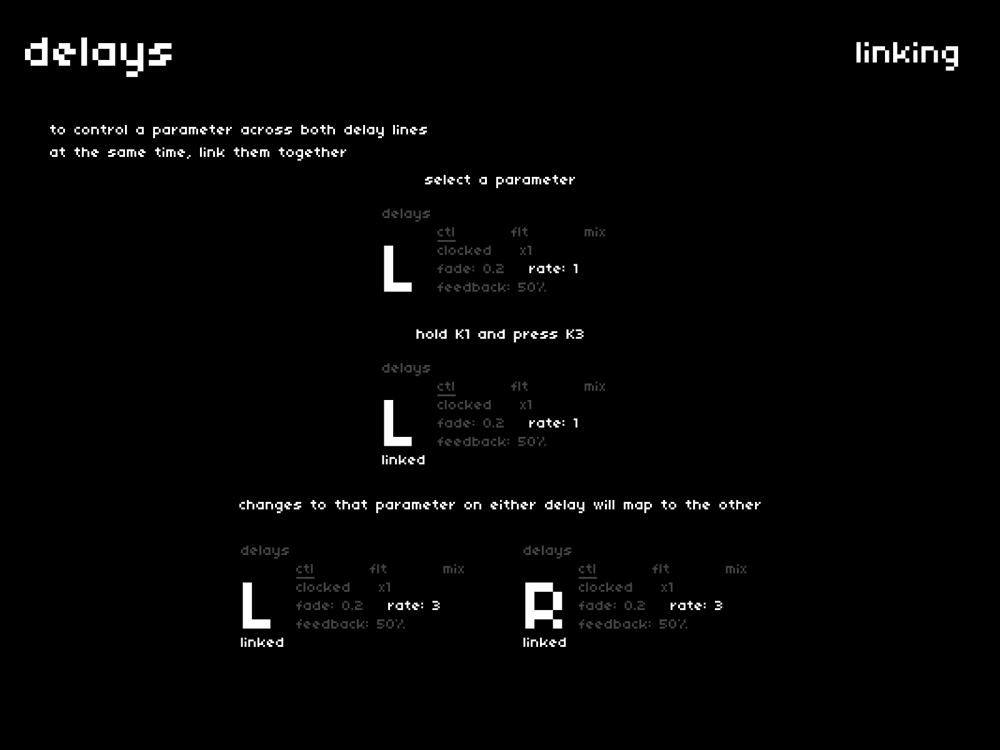

that was a lot of delay parameters.

*q: "how can I possibly change the same parameter for both delays?"*  
*a: linking.*

to toggle linking for a single parameter across both delay lines:

- select the parameter
- hold `K1` and press `K3`

to toggle linking for an entire section of parameters:

- navigate to the section header (might need `K3`)
- hold `K1` and press `K3`
- the link state for all parameters in the section will toggle

changes to a *linked* parameter map across delays.  
it can be very fun to selectively toggle parameter linking during play.