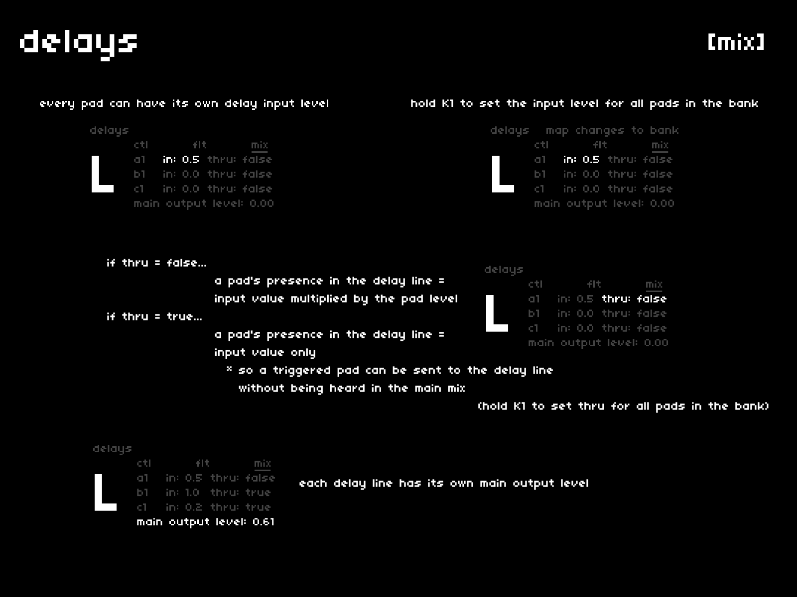

## in + thru
---

as with most settings in cheat codes, each pad can have its own input level for each delay.  
hold `K1` to set the **in** level for all pads in the bank at the same time.

the signal flow is: pad level -> **in** -> **main output level**  

the **thru** state determines whether the pad's level is factored into the equation:

- if **thru** is *false* (default), then the pad level must be greater than 0 in order for it to be heard as the **in** level increases
- if **thru** is *true*, then the pad level is not queried and the pad's **in** level controls the delay send amount

to achieve a [dakim-style](https://youtu.be/AmQ7AMnooj0?t=66) effect where the pads are not heard when played, but end up in the delay line:

- **thru**: *true*
- **in**: *1.0* for all pads in the bank
- **main output level**: > 0