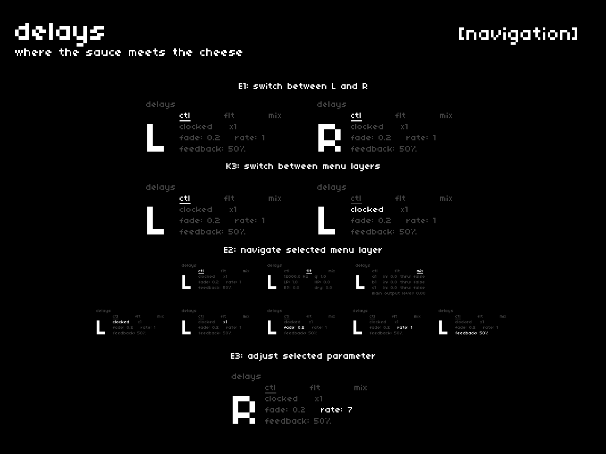

the final audio processing stage in cheat codes is its hard-panned stereo delay.  
this is a wrapper around two additional softcut voices, into which each pad is fed.  
in a way, **[delays]** is a cheat codes for your cheat codes.

## navigation + control
---

| hardware |--->| action |
|:---|:---:|:---|
| `E1` |--->| switch between L and R |
| `K3` |--->| switch between menu nav and parameter adjustment |
| `E2` |--->| navigate the selected menu's parameters |
| `E3` |--->| adjust the selected parameter |