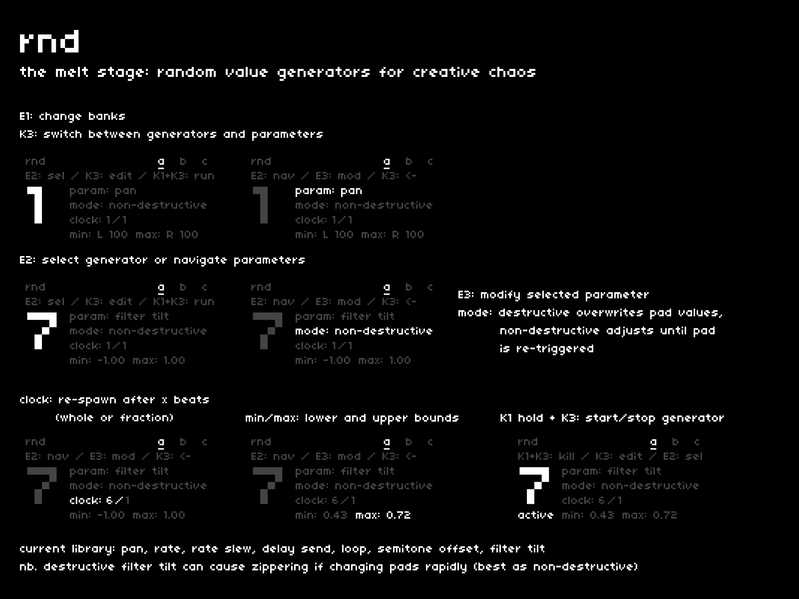

sometimes, you need a few extra hands.  
**[rnd]** is basically a pile of tricksy hands.

## navigation + control
---

| hardware |--->| action |
|:---|:---:|:---|
| `E1` |--->| change banks |
| `K3` |--->| switch between random value generators and their parameters |
| `E2` |--->| select a generator or navigate parameters |
| `E3` |--->| adjust the selected parameter |
| `K1 hold + K3` |--->| spawn/kill a random generator |

## random generators
---

there are 7 total random generators per bank, which can each modify up to 7 parameters.  

by default, each random generator is assigned a unique parameter, but multiple generators can share the same target:

- pan
- rate
- rate slew
- delay send
- loop
- semitone offset
- filter tilt

## behavior
---

once a generator has a target parameter, you can further define its behavior:

- **mode**: non-destructive or destructive
- **clock**: determines how often a re-spawn should occur, in beats
- **min** + **max**: fence in the lower and upper bounds

### non-destructive vs. destructive

when a pad is triggered while a random generator is running, the pad's inherent parameter values are re-instated.

in non-destructive mode, the current pad's parameter values are not overwritten -- in destructive mode, they are.  
this determines a great deal in terms of playability.

I'd use *non-destructive* mode if I have a looping pad which I won't be re-triggering.  
I'd use *destructive* mode if I have a series of pads being rapidly re-triggered with an arp or pattern.

*nb. filter tilt is best in non-destructive mode, as that ensures fluid changes to the cutoff frequency. destructive mode can introduce audible zippering.*